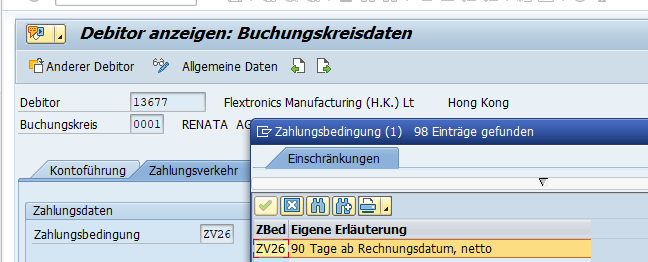

# Automatische Liefersperre für Kunden

| Grund der Aenderung | Update IKS |
| ------------------- | ---------- |

Beim Anlegen von Lieferungen erfolgt eine automatische Kreditprüfung, welche bei Nichteinhalten der Kriterien zu einer Sperre führt.

#### Folgende Risikoklassen wurden definiert:

| **Risikoklasse**                   | **Kriterium**                                         | **Dynamische Prüfung (Prüfung Einhaltung Kreditlimite)** |
| ---------------------------------- | ----------------------------------------------------- | -------------------------------------------------------- |
| 002 neutral                        | Nur Intercompany                                      |                                                          |
| 003 Lieferung mit niedrigem Risiko | analog 004                                            | analog 004                                               |
| **004 Lieferung mit hohem Risiko** | **gilt generell für alle neu anzulegenden Debitoren** | **Ja, Horizont 90 Tage**                                 |

Bei einer Abweichung von bis zu 1%/ 10 Tagen erfolgt bei bereits freigegebenen Lieferungen keine erneute Prüfung, solang keine Änderungen vorgenommen werden.

Bei Bedarf erfolgt die Anlage von Risikoklassen mit der SAP Transaktion **OVA8**

**Ablauf für die Freigabe der gesperrten Lieferungen**

**1.) SAP Transaktion VKM4**

Variante: 0001

Überprüfen, ob der Kunde in der Kreditsperre ist und ob die Lieferung freigegeben werden kann:

Gratis-, Musterlieferung/ > Betrag (Kreditwert) = 0.00 > Freigabe

reguläre Bestellungen

Streckengeschäft Duracell > Betrag egal, Transportnummer 80xxxx wird angegeben nach Buchung der Rechnung (ohne Variante, nur die 80xxxx Nummer eingeben)

\> Freigabe

*
  *
    *
      *
        * Anklicken Icon Bearbeitergruppe
        * Anklicken Icon „grünes Fähnchen“ (Freigabe)
        * Speichern
        * Information an Orders/Eulog, dass Freigabe erfolgt ist

/

ZV05 = Vorauskasse Die Freigabe darf nur dann erfolgen, wenn der Kunde ein Guthaben

mindestens in der Höhe der freizugebenden Lieferung auf seinem

Konto stehen hat.

~~Dokumentarinkasso/Akkreditiv Freigabe nur mit korrekt vorliegendem Akkreditiv, das von der~~

~~Ägypten Credit Suisse bestätigt ist.~~

~~Doku unter N:\Daten\80 Finanzen\02 - Finanzen~~

~~allgemein\Administration\Dokus\FI Dokus\Debitoren)~~

Zahlungsbedingungen können in FD03 geprüft werden in den Buchungskreisdaten:

Für alle anderen Fälle weiter bei 2.)

**2.) Offen Posten (FBL5N)**

Als Nächstes muss auf dem Debitorenkonto geprüft werden, ob offene Posten vorhanden sind, und ob diese eine Mahnstufe haben und wie die Zahlungsmoral des Kunden ist.

Ohne Mahnung/ 1. Mahnstufe (=SOA/Kontoauszug)

Fälligkeitsdatum + 13 Tage:

Freigabe bei vorliegendem Zahlungsavis der Bank des Kunden

**ODER** Freigabe bei guter Zahlungsmoral (regelmässige Zahlung nach 1. Mahnung)

\+ Rückmeldung auf gesendeten Kontoauszug (SOA) prüfen

2\. Mahnstufe (1. Mahnung)

Liefersperre bleibt bestehen, bis der überfällige Betrag auf dem Kundenkonto eingegangen ist

– ggf. Rücksprache CFO/Visum

3-4. Mahnstufe (2. + Letzte Mahnung)

Liefersperre bleibt bestehen, bis das gesamte Konto wieder auf 0 ist, ggf. Rücksprache CFO/KAM

Möglichkeit der Änderung Zahlungsbedingung auf Vorauskasse prüfen.

Monatsrhythmus > Kunden die regelmässig einkaufen und eine monatliche Überweisung tätigen, regelmässig Zahlungsausstände zu 0.00 begleichen > Freigabe, sofern das Kreditlimit nicht sehr hoch überschritten ist > Sonst Visum CFO einholen

**3.) Kreditlimit** SAP> FD32 – Kreditkontr. Bereich 0001

Nur wenn der Kunde keine Mahnstufe/ 1. Mahnstufe hat! (Bei 2. Mahnstufe ggf. Rücksprache CFO)

Prüfen, ob das Kreditlimit überschritten ist oder nicht.

Vergleich von Kreditlimit mit dem Gesamtobligo (= alle offenen Rechnungen, sowie alle eingelasteten

Aufträgem (Vertriebswert))

Ist das Kreditlimit höher als das Obligo, muss kein Visum eingeholt werden.

Ist das Kreditlimit niedriger als das Obligo, gilt folgender Ablauf:

Überschreitungen - Betrag Kreditlimit <-> Betrag in der Kreditsperre (VKM4) gering im Vergleich zum üblichen Auftragsvolumen

(in FBL5N prüfen, was so monatlich fakturiert wird) > Freigabe, sofern keine überfälligen offenen Posten vorhanden sind

\- Betrag Kreditlimit <-> Betrag Kreditsperre> gross > Rücksprache / Visum CFO

Die Kreditlimite werden, rollierend und auf Anforderung, durch die Buchhaltung überprüft und generell für Neukunden im Ausland angefordert, wenn nicht gegen Vorauskasse geliefert wird.
